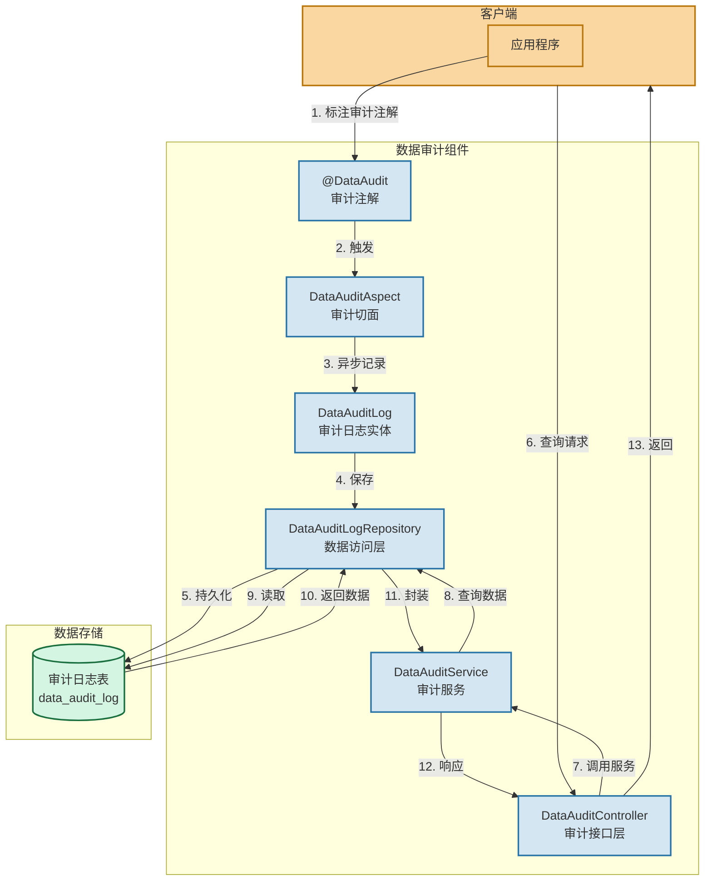

# 数据审计组件

数据审计组件组件说明和要求：

1. 组件的功能是对数据库表的 DML 操作自动审计，记录数据的变化过程。
   a. 插入操作，则记录变更动作为新增，变更详细记录为新插入的数据行；
   b. 修改操作，则记录变更的字段前后值；
   c. 删除操作，则记录被删除的数据行；
2. 数据审计尽量减少对应用程序正常执行的性能影响，使用横切面方式实现。
3. 数据审计操作失败，不影响应用程序的正常执行。
4. 持 oracle，mysql 数据库。
5. 可以对指定的表、指定的字段进行审计；
6. 定义审计组件的能⼒输出形式和规范，如 jar 包引用，注解注入，http 接口调用等形式；
7. 如有⼀定的 web 开发能力，可以设计前端展示页面，统⼀展示审计数据。

## 核心功能实现

1. 使用 Spring AOP 实现，最小化对业务代码的侵入
2. 支持 INSERT、UPDATE、DELETE 操作的审计
3. 异步记录审计日志，不影响主流程性能
4. 支持指定表和字段的审计
5. 使用 JPA 作为 ORM 框架，天然支持 Oracle 和 MySQL，可通过配置文件切换数据源

## 使用方式

```java

@DataAudit(tableName = "user", fields = {"name", "email"})
public User updateUser(User user) {
    return userRepository.save(user);
}
```

## 架构图



## 未来展望

扩展建议：

1. 可以添加前端页面，使用 Element UI 或 Ant Design 实现审计日志的查询和展示
2. 可以添加导出功能，支持审计日志的导出

未来可优化点：

1. 可以考虑使用消息队列进一步优化性能
2. 可以添加审计日志的定期归档功能
